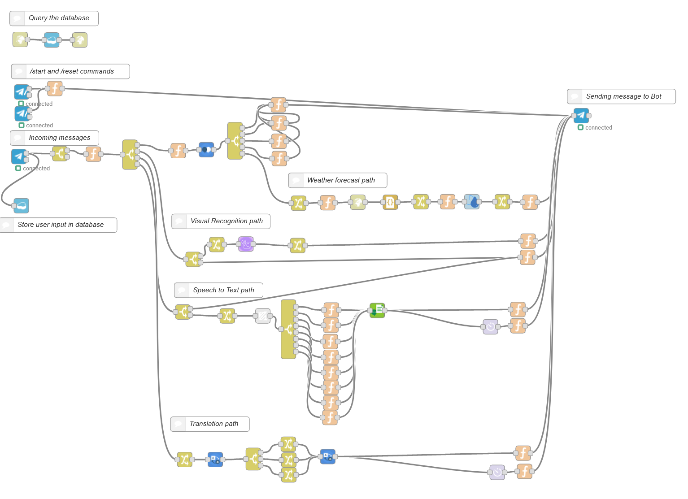

# Complete flow


## How to get up and running

This is the complete flow as I use it. Credentials of the Watson AI nodes have been removed. Also the API key of the http call to opengatedata, which translates the location from word to coordinates, has to be modified the following way:

```
msg.url = "https://api.opencagedata.com/geocode/v1/json?q=" + msg.loc + "&key=REPLACE_WITH_YOUR_APIKEY&language=en&pretty=1"
return msg;
```
The variable REPLACE_WITH_YOUR_APIKEY in the URL has to be replaced with your individual API key that you receive after registering at [opencagedata.com](https://opencagedata.com/)

The function node right before the "http get request node" carries the code shown above.

## Hints
- Make sure you have all required IBM Cloud services and node modules. Check them [here](https://github.com/RapTho/telegramBot/blob/master/README.md#requirements)
- In the IBM Cloud you can [connect your services to your Node-RED instance](https://cloud.ibm.com/docs/resources?topic=resources-connect_app). This saves you the copy and pasting of your API keys. 
- Increase your Node-RED instance's volume to 1GB to have enough storage for all your content.
- Use the [debug node](https://nodered.org/docs/user-guide/nodes#debug) to find potential errors step by step
