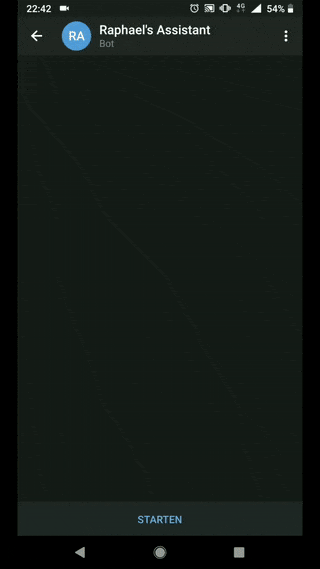
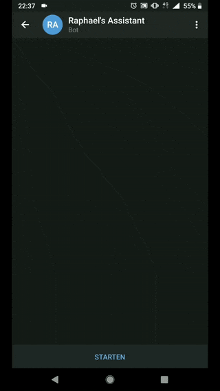
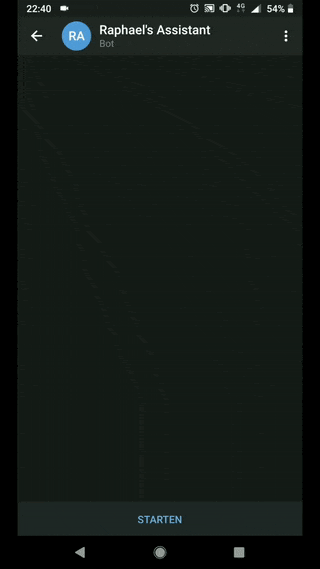

# telegramBot 
This is a code repo that shares my personal telegram bot. The bot is a side project I build combining IBM's Watson AI services and third party APIs. The integration of all services happens on a [Node-RED](https://nodered.org/) server hosted in the [IBM Cloud](https://www.ibm.com/cloud/). All of this is **possible with a free account**.

## Visual Recognition
One of the bot's skills is to see what you see

## Speech to Text
Also, you can dictate your bot something and it will transcribe the spoken words for you. The supported languages are:
- English
- French
- German
- Spanish
- Japanese
- Korean
- Chinese (Mandarin)
- Arabic

## Translation
The bot can also assist you with translations. It will automatically detect which language the input has and translate it to the user desired output language.

## Weather forecast
Get the latest weather updates directly on your smartphone by asking your bot for it. The location is picked from your input and then translated into coordinates by a third party. These coordinates will be used to query the Weather Company database and return accurate results.

# Requirements
- Free [IBM Cloud](https://www.ibm.com/cloud/) account
- Bot created with Telegram's [Botfather](https://core.telegram.org/bots)
- Free [opencagedata](https://opencagedata.com/) account
- The [Telegram messenger](https://telegram.org/) installed on your smartphone

## IBM Cloud services
The following IBM Cloud services need to be instantiated. Free/light plans are always sufficient. No need to add any payment method. Students can get more resources [here](https://ibm.onthehub.com/WebStore/OfferingDetails.aspx?o=142ecca8-0403-e911-810e-000d3af41938).
- [Watson Assistant](https://www.ibm.com/cloud/watson-assistant/)
- [Watson Visual Recognition](https://www.ibm.com/watson/services/visual-recognition/)
- [Watson Speech-to-Text](https://www.ibm.com/watson/services/speech-to-text/)
- [Watson Language Translator](https://www.ibm.com/watson/services/language-translator/)
- [Weather Company Data](https://cloud.ibm.com/catalog/services/weather-company-data)
- [Node-RED](https://cloud.ibm.com/catalog/starters/node-red-starter)

## Node packages (from npm repository)
The following modules are required and can be installed directly in Node-RED (equivalent to "npm install")
- node-red-bluemix-nodes
- node-red-contrib-telegrambot
- node-red-node-cf-cloudant
- node-red-node-watson
- node-red-contrib-media-utils

## Final words
The Node-RED server in this example is hosted on the IBM cloud but it can just as well run on any local device such as a Raspberry Pi or other servers/desktops/laptops as long as they have internet access. Check the [instructions](https://nodered.org/docs/getting-started/installation).
