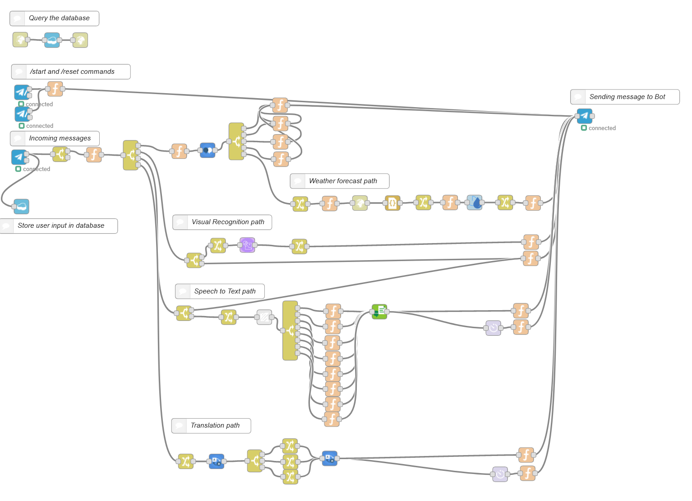

# Complete flow


## How to get it up and running
This is the complete flow as I use it. All the credentials have been removed before exporting the flow. 

Make sure you have all required IBM Cloud services instantiated and all node modules installed. Check again [here](https://github.com/RapTho/telegramBot/blob/master/README.md#requirements)

Copy the [node-red-complete-flow.json](https://github.com/RapTho/telegramBot/blob/master/build/node-red-complete-flow.json) content and import it into your Node-RED instance. See [how it's done](https://nodered.org/docs/user-guide/editor/workspace/import-export)

Do the same for the [Watson Assistant JSON file](https://github.com/RapTho/telegramBot/blob/master/build/skill-Telegram_Bot.json). Do it like [this](https://developer.ibm.com/tutorials/learn-how-to-export-import-a-watson-assistant-workspace/) or in the Dashboard when creating a new skill: </br>Watson Assistant Dashboard -> Skills -> Create Skill -> Import skill -> Choose JSON

In the IBM Cloud you can [connect your services to your Node-RED instance](https://cloud.ibm.com/docs/resources?topic=resources-connect_app). This saves you the copy and pasting of your API keys. You should connect the following services:
- Cloudant database that was automatically created when instantiating Node-RED
- Watson Visual Recognition
- Watson Assistant
- Watson Speech-to-Text
- Weather Company Data

Otherwise just copy+paste your keys to the required nodes. The telegram nodes also need the API key and name of your bot. You get this information from the [botfather](https://core.telegram.org/bots) himself.

Also the URL of the HTTP GET call to opencagedata, which translates the location from word to coordinates, needs to be modified the following way:

```
msg.url = "https://api.opencagedata.com/geocode/v1/json?q=" + msg.loc + "&key=REPLACE_WITH_YOUR_APIKEY&language=en&pretty=1"
return msg;
```
The variable REPLACE_WITH_YOUR_APIKEY in the URL has to be replaced with your individual API key that you receive after registering at [opencagedata.com](https://opencagedata.com/)

The function node right before the [HTTP request node](https://cookbook.nodered.org/http/simple-get-request) carries the code shown above.

## Hints
- If necessary increase your Node-RED instance's volume to 1GB to have enough space for all your content.
- Use the [debug node](https://nodered.org/docs/user-guide/nodes#debug) to find potential errors step by step